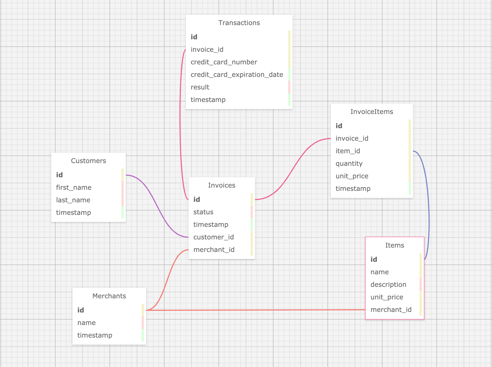

# Rales Engine

A solo project completed during Module 3 at Turing School of Software and Design.

Rales Engine implements:
* Object oriented programming principles.
* Building versioned Ruby on Rails APIs.
* Use of Ruby and ActiveRecord to perform complex business intelligence queries
* Custom built rake task to import sales data from CSV files.
* Controller tests to drive design.
* Serialized JSON response.

## Requirements

* Ruby 2.4.1
* Rails 5.1.7

## Setup

1. Clone the following repo: [Rales Engine](https://github.com/hsmitha26/rales_engine)
2. From your terminal:
`git clone https://github.com/hsmitha26/rales_engine`
`cd rales_engine`
`bundle install`
3. Database setup:
`rake db:{create, migrate}`
4. Run the following rake tasks to import from CSV files:
`import:customers`
`import:merchants`
`import:items`
`import:invoices`
`import:invoice_items`
`import:transactions`

## Gems Used
* Pry
* RSpec
* Factory Bot
* Shoulda Matchers
* Fast JSON API

## Running
From your terminal, run `rails s` and append http://localhost:3000/api/v1 to access one of the various endpoints.

For example: to access a list of all the merchants, append the above url to:
http://localhost:3000/api/v1/merchants

### Endpoints - Exposes Serialized JSON Response
Record endpoints for: merchants, customers, items, invoices, invoice_items and transactions.

Example:
`GET /api/v1/merchants` - shows all the merchant records.
`GET /api/v1/merchants/1` - shows a merchant record with an id of 1.
`GET /api/v1/merchants/random` - shows a single merchant record selected.

### Testing
Controller and model tests can be run using RSpec:
`rspec`

## Database Schema

